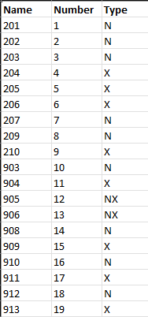
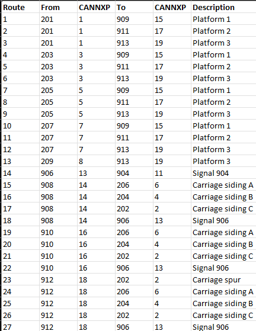
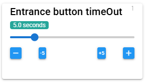
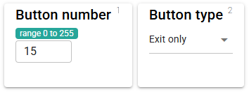
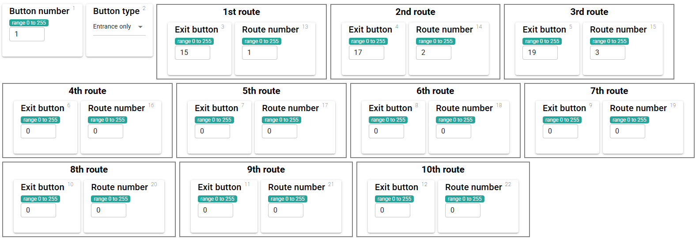

# CANNXP
CBUS module to compute eNtry/eXit routes with a little bit of prototypical OCD.

Based on CANNX written by Sven Rosvall with, of course, acknowledgement of all his hard work.

See [description of CANNX](https://merg.org.uk/merg_wiki/doku.php?id=arduino:cannx)
in the MERG Knowledgebase.

## Overview

A route is set between an entrance button and an exit button. Each button can be valid as an entrance, exit or both. The first button to be pressed should be an entrance button and the second button an exit which makes logical sense as a route from the entrance. When an entrance button is pressed, it will start to flash. If no exit button is pressed within a certain time (typically five seconds), the process is cancelled and the flashing stops. If a button is pressed, but it is not a valid exit for the selected entrance then the processing is cancelled and the flashing stops. If a valid exit button is pressed, the entrance button light will become steady and the route will be "called".

Note that on larger panels, there is the concept of a "flasher ring" which groups the entrance buttons so that multiple signalmen can set multiple routes simultaneously. That concept is not supported here - only a single entrance button can be active at any one time.

Due note has been taken of Sven's point about ensuring that a module only does one thing, and does it well. Accordingly, functionality which is part of the route "calling" process has been included here. However functionality beyond that such as route "setting" and "clearing" has not been included and will ultimately be handled elsewhere.

## Route design

It is probably easiest to create a spreadsheet for clarity. 

Each button whether entrance, exit or combined is given a unique number. Then each possible route (from an entrance to an exit) is also given a unique number. This example shows the translation between actual signal numbers on the layout/panel and those numbers used within CANNXP.

Then all of the possible routes are identified and numbered. This example shows the route number that has been allocated and then the layout/panel numbers and the corresponding numbers used within CANNXP.

This is significantly more complicated than the arrangement used in CANNX, but is intended to enhance the prototypical aspects of the route setting process. Specifically, it:

- differentiates between entrance, exit and combined buttons.
- does not assume that all routes are reversible.
- forces sequential routes to be set using for example buttons A-B-B-C (whilst A-B-C is appropriate for a model railway, it is not prototypical for a UK NX panel).

The CANNXP produces certain events as part of its processing, with the event numbers being as follows (Opcode / High Byte / Low Byte):

- ACON / 1 / Entrance Button Number - produced when a valid entrance button is pressed. Used to start the entrance button flashing.
- ACON / 0 / Route Number - produced when a route from an entrance to an exit button has been called successfully. Used to start the route setting process.
- ACON / 2 / Entrance Button Number - produced when a route from an entrance to an exit button has been called successfully. Used to light the entrance button steadily.
- ACOF / 1 / Entrance Button Number - produced when an entrance button times out, or an invalid exit button is selected. Used to stop the entrance button flashing.

Bob Vetterlein's suggestion of using the high byte to create the range of events has been taken on board.

## Node Variables

### NV1 - Entrance button timeout

The time in seconds that the CANNXP will wait for an exit button to be pressed after an entrance button has been activated.

## Event Variables

### EV1 - Button Number 

All buttons involved with route setting are allocated a unique number. Routes are then defined as going between two buttons (a button capable of acting 
as an Entrance and a button capable of acting as an exit). The number is abitrary and cannot be zero.

### EV2 - Button Type

Depending on their position on the track layout, buttons can have different functions. These are identified as follows:

- 1 - Entrance button
- 2 - Entrance and exit button
- 3 - Exit button

### EV3 through EV12 - Valid exit buttons

Only relevant for button types 2 and 3 (buttons which support exit functionality). Each EV contains the button number of an exit button which would 
be a valid exit for the entrance button defined in EV1. This restricts the maximum number of routes from any entrance button to ten.

### EV13 though EV22 - Route numbers

Only relevant when a valid exit button has been specified in the corresponding EV (EV3 through EV12). The unique number here is used to define 
the route between the specified entrance and exit buttons.

## Configuration using MMC

A module definition file (MDF) has been created to aid configuration of the CANNXP using MMC. 

### Node Variables

The Node Variable configuration is unchanged from CANNX.

### Event Variables

For buttons which only support exit functionality no additional information is required, so a simple configuration screen is displayed.

For buttons which support entrance functionality, valid exit buttons and the resultant routes are required, so a more complex screen is displayed.

The number of each applicable exit button and the corresponding route numnber should be added (again, a spreadsheet list is your friend).

